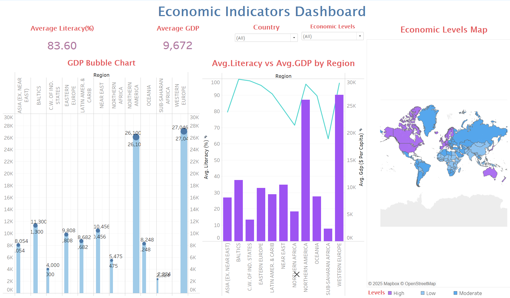
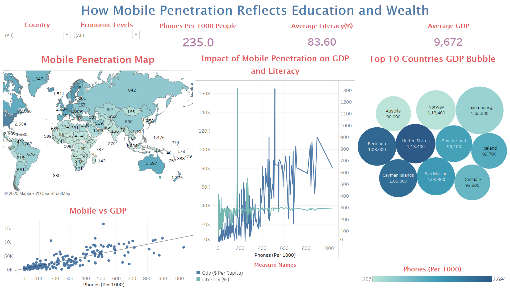
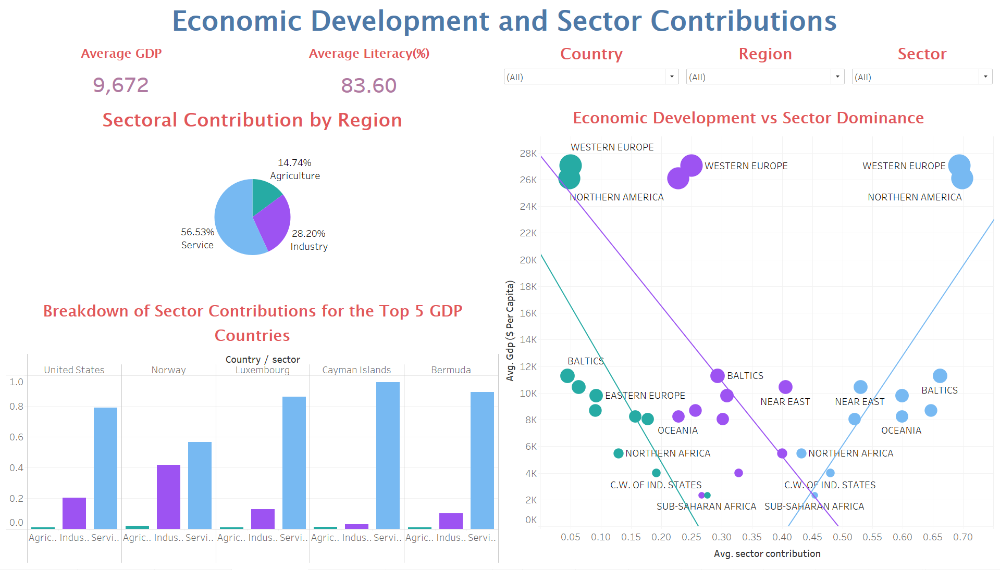
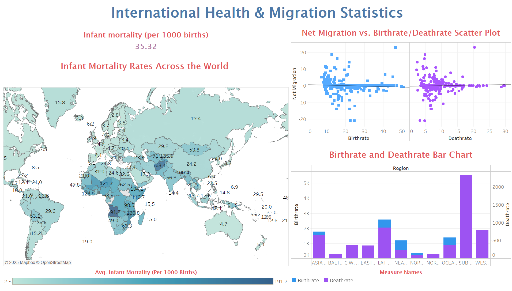
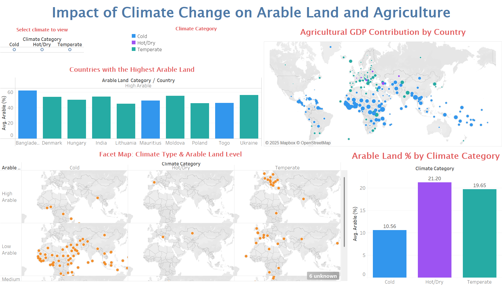

# Global Development Indicators – Tableau Storytelling
This is a Tableau storytelling project built on a global development indicators dataset. The project explores how climate, land, agriculture, health, migration, economic structure, and mobile penetration interact across countries and regions worldwide.

## Dataset
Source: World Bankopen data
Key Columns
- country, region – Country name and geographic region
- population, area_sq_mi, pop_density – Size, land area, and population density
-	coastline, climate – Coastal ratio and climate index
-infant_mortality_per_1000_births, birth_rate, death_rate – Core health indicators
-	gdp_per_capita, agriculture, industry, service – Economic and sectoral indicators
- literacy, phones_per_1000 – Education and technology penetration
- arable, crops, other – Land-use distribution

# Dashboards Overview
## **Dashboard 1 – Global Development Indicators**

Overview dashboard showing a region-colored world map summarizing key development indicators and acting as the entry point into the story.
This dashboard presents a region-coded world map summarizing: Population, GDP per capita, Literacy,	Health, Land use  

## **Dashboard 2 – Economic Development & Sector Contributions**

Economic structure dashboard comparing average GDP, literacy, and the relative contribution of agriculture, industry, and services by region and by top GDP countries.
explores:GDP per capita vs literacy, Sector-wise contribution (Agriculture, Industry, Services), Regional economic dependency, Top 5 GDP-performing countries  

 ## **Dashboard 3 – Economic Indicators & Inequality**

 
Economic indicators dashboard linking GDP per capita, literacy, and a global economic-levels map to highlight regional inequalities.
combines:GDP bubble chart, Dual-axis Literacy vs GDP chart, Global Economic Levels Map 

## **Dashboard 4 – Health & Migration Statistics**

 
Health and migration dashboard connecting infant mortality, birth and death rates, and net migration to reveal population and wellbeing patterns.
This dashboard visualizes:	Infant mortality (choropleth map), Birth and death rates,	Net migration trends 

## **Dashboard 5 – Climate Change, Arable Land & Agriculture**

Climate–agriculture dashboard analyzing arable land levels, climate categories, and agricultural GDP dependence across countries.
This dashboard links:Climate type, Percentage of arable land, Agricultural GDP contribution 

## **Dashboard 6 – Digital Penetration, Education & Wealth**

Digital development dashboard relating mobile phones per 1000 people to GDP per capita and literacy, plus a bubble view of the top 10 economies.
This dashboard compares:Mobile penetration, Literacy, GDP per capita 

## How to Open the Project
1.	Open the Tableau workbook (.twb or .twbx) in: Tableau Desktop or Tableau Public (Version X or higher)
2.	Ensure the file below is available: data/countries-of-the-world_cleaned.csv Or manually update the data source inside Tableau
3.	Use the built-in filters
